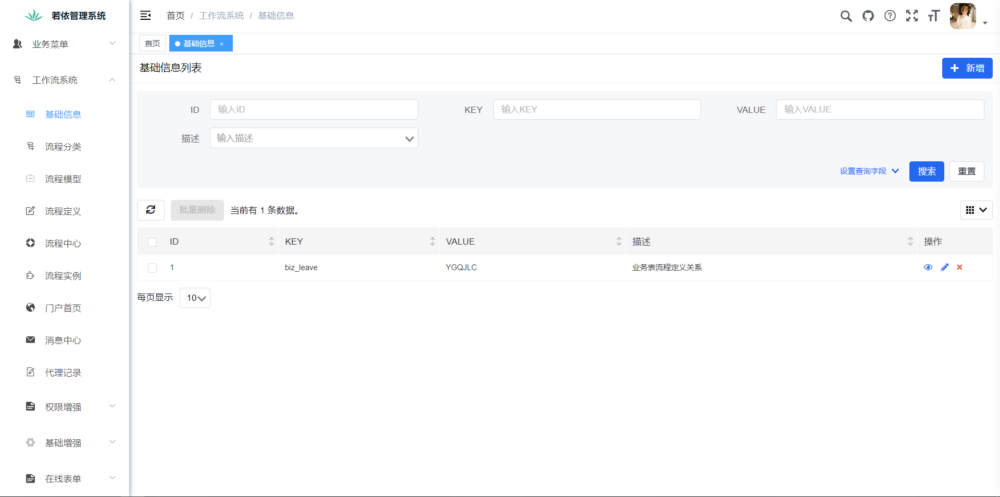
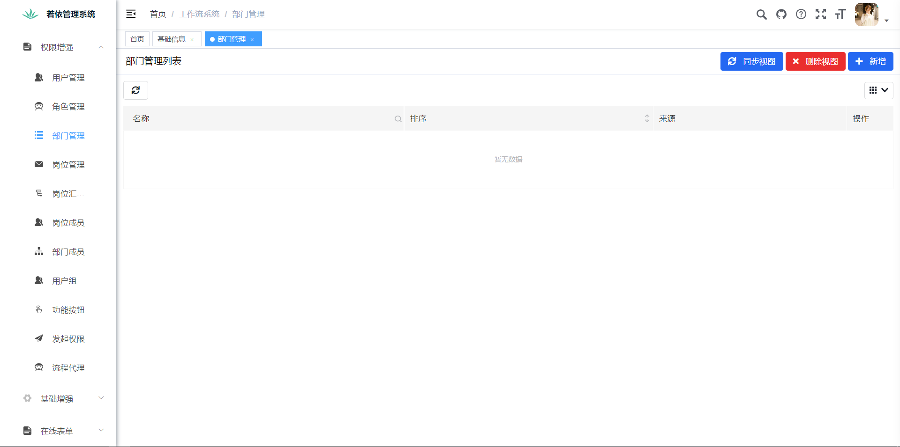
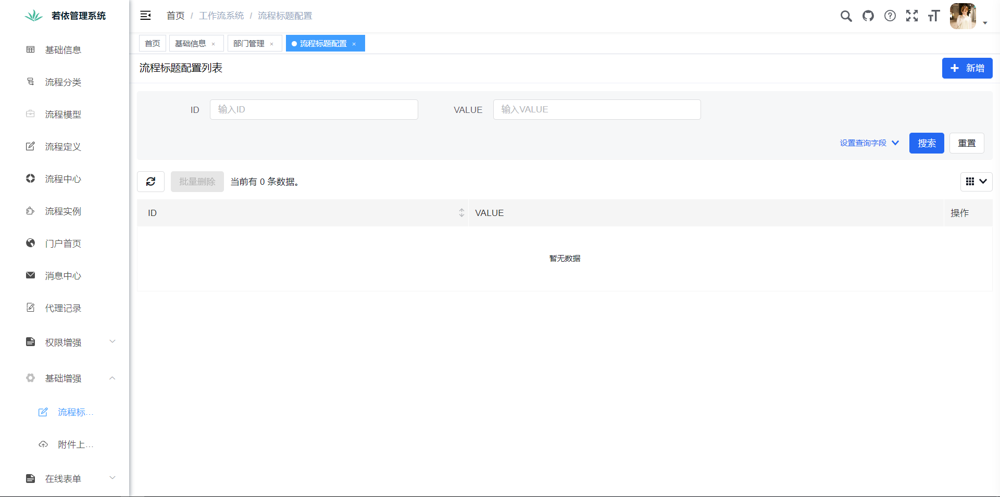
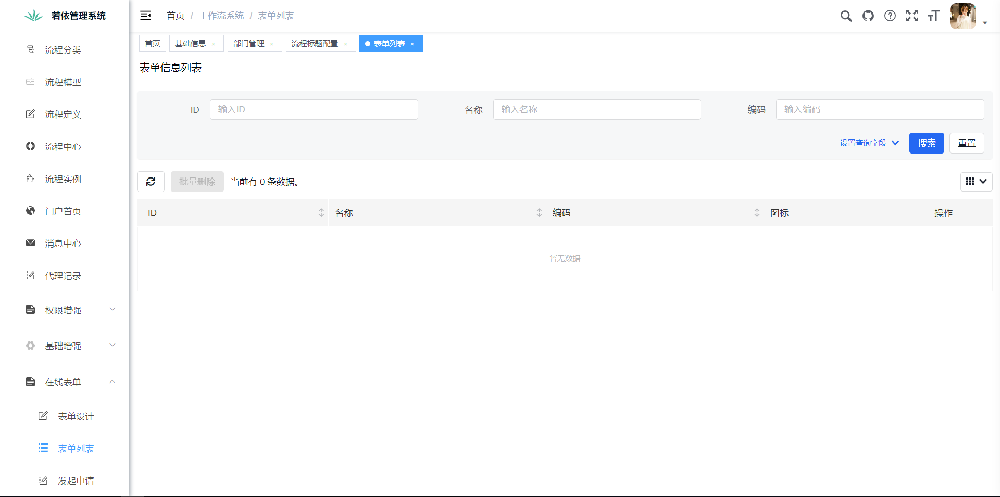

# 闲鹿工作流 jar 包封装版

[TOC]

闲鹿工作流 jar 包封装版，工作流功能开箱即用，兼容 RuoYi 和 RuoYi-Vue 任意版本。

### 一、功能截图

### 二、使用方式

#### 2.1 整合文档

详见 [整合文档](整合文档/若依前后端分离版整合闲鹿工作流.pdf)

**按照整合文档步骤，可以集成任意版本的 RuoYi-Vue，其中 jar 包位于本项目 jar 目录下。**

#### 2.2 用户手册

详见 [用户手册](用户手册/闲鹿工作流(前后端分离)用户手册.pdf)

### 三、视频介绍

https://www.bilibili.com/video/BV1hB4y1Y7N3

#### 3.1 系列视频

[闲鹿工作流快速开发框架](https://space.bilibili.com/111672227/channel/collectiondetail?sid=561440)

### 四、演示地址

http://139.198.104.199:83/index
账号密码 admin / xianluactiviti

**静态资源过多，导致页面加载缓慢。本地运行项目速度会快很多。**

**解决方案：后期项目上线可以把静态资源做 CDN 加速。**

### 五、商业说明

开源**不代表**无条件免费使用。

本项目提供免费学习交流，企业内部自用或者客户定制开发**需商业授权**。

详情联系作者微信 huangluqian12345、QQ 1055202292、电话 13123392160。备注：闲鹿工作流

